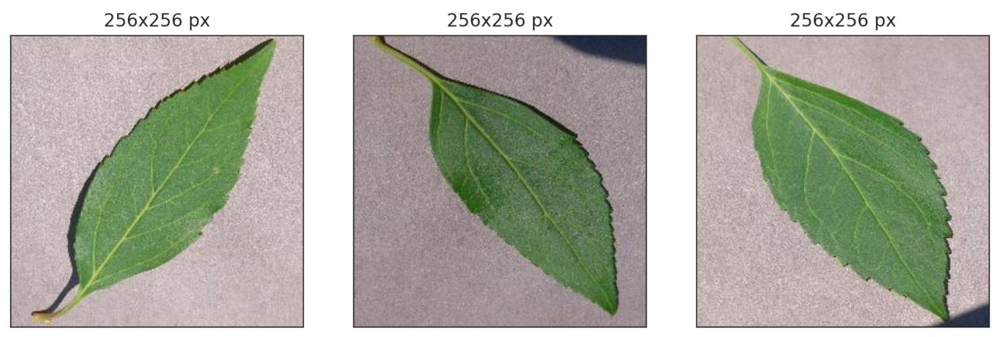
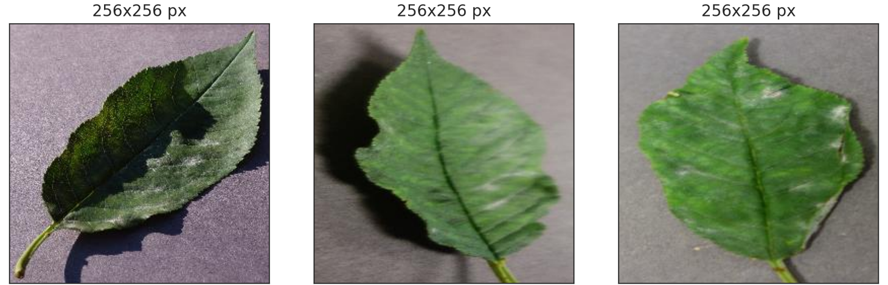
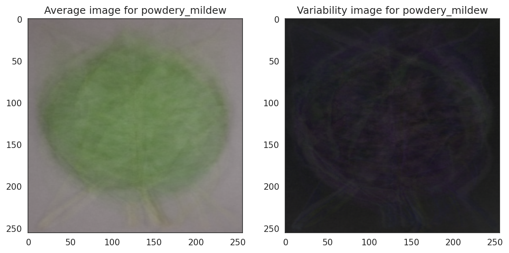
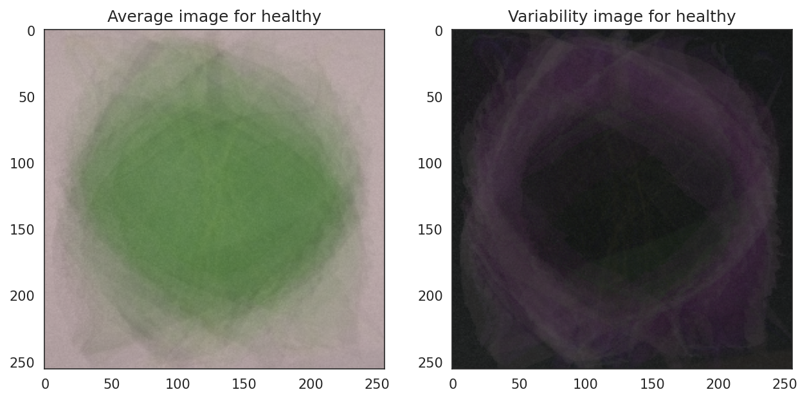
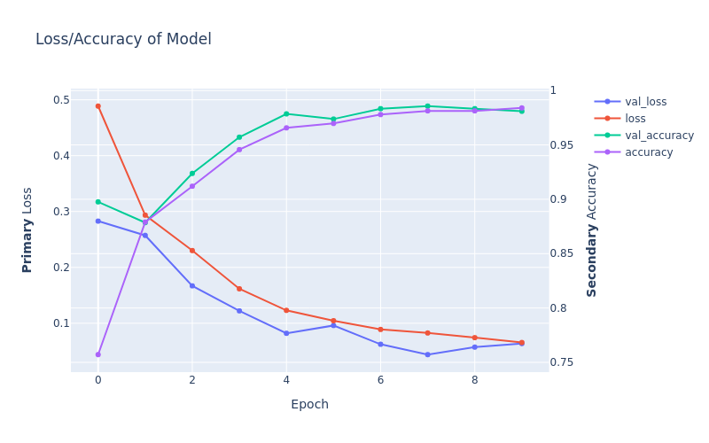

# Cherry Leaf Disease Detector


## Introduction

The **Cherry Leaf Disease Detector** is a machine learning solution developed to assist the agricultural industry, specifically Farmy & Foods, in early detection of powdery mildew on cherry leaves. The project leverages Convolutional Neural Networks (CNNs) for accurate image classification, helping farmers identify infections early to protect crop yield and quality. This project is part of the Code Institute's Full Stack Software Development Bootcamp.

The application is integrated into an intuitive Streamlit dashboard where users can upload images of cherry leaves to receive real-time predictions. The solution is scalable, making it adaptable for detecting other plant diseases in the future.

  
*Illustration: The Cherry Leaf Powdery Mildew Detector app showcasing its responsive design across different devices.*

### Deployed Version
[Cherry Leaf Disease Detector](https://cherry-leaf-disease-detection-63b42bf0104d.herokuapp.com/)

---

## Table of Contents

1. [Dataset Content](#dataset-content)
2. [Business Requirements](#business-requirements)
3. [Hypothesis and Validation](#hypothesis-and-validation)
4. [Rationale for the Model](#rationale-for-the-model)
5. [The Rationale to Map the Business Requirements to Data Visualizations and ML Tasks](#the-rationale-to-map-the-business-requirements-to-data-visualizations-and-ml-tasks)
6. [Strategic Vision for Machine Learning Integration](#strategic-vision-for-machine-learning-integration)
7. [Project Dashboard](#project-dashboard)
8. [CRISP-DM Process](#crisp-dm-process)
9. [Bugs](#bugs)
10. [Deployment](#deployment)
11. [Technologies Used](#technologies-used)
12. [Testing](#testing)
13. [Credits](#credits)

---

## Dataset Content

The dataset used in this project comprises over 4,000 high-resolution images of cherry leaves, meticulously categorized into two distinct classes: **healthy leaves** and **leaves infected with powdery mildew**. This dataset, sourced from [Kaggle](https://www.kaggle.com/datasets/codeinstitute/cherry-leaves), serves as the backbone for building a machine learning model capable of detecting fungal infections by analyzing visual symptoms. Infected leaves display characteristic signs such as white powdery growth and circular lesions, making them visually distinguishable from healthy ones. The dataset's comprehensive collection ensures that the model is trained with a wide range of examples for enhanced learning.

To achieve optimal model performance, the dataset was divided into three subsets: 70% for training, 10% for validation, and 20% for testing. Training data is used to teach the model patterns associated with the two classes, while validation data helps fine-tune parameters and prevent overfitting. The test set, comprising unseen data, is used to evaluate the model's generalization capabilities. Before feeding images into the model, several preprocessing steps were applied, including resizing all images to a uniform dimension to ensure compatibility with the neural network, normalizing pixel values for better pattern recognition, and applying data augmentation techniques such as flipping, rotation, and zooming to artificially increase dataset diversity. These steps collectively enhance the robustness and accuracy of the model, enabling reliable predictions for real-world agricultural applications.

## Business Requirements

A prominent agricultural company has requested the development of a Machine Learning-based solution to efficiently identify powdery mildew on cherry tree leaves. With thousands of cherry trees distributed across multiple farms, the manual inspection process currently in use is highly time-consuming and lacks scalability for their expansive operations.The current manual inspection process is time-intensive and unsustainable given the scale of their operations, which span thousands of cherry trees across multiple farms nationwide.


1. **Identify Visual Distinctions:**  
   Perform a detailed analysis to visually distinguish between healthy leaves and those affected by powdery mildew, helping Farmy & Foods gain insights into visible symptoms.

2. **Precision Detection System:**  
   Create a reliable and accurate predictive model to classify cherry tree leaves as either healthy or infected. The system must achieve a **minimum accuracy of 97%**, ensuring minimal errors in predictions to optimize resource use and protect crops effectively.

3. **Intuitive and Accessible Dashboard:**  
   Design a user-friendly, web-based interface that simplifies the process of uploading images and obtaining results. The dashboard must cater to non-technical users while ensuring compatibility with various devices, including smartphones and desktops.

4. **Generate Actionable Reports:**  
   Provide a comprehensive analysis of the predictions in the form of reports. These reports will assist Farmy & Foods in making informed decisions about crop treatments and disease management.

5. **Future Scalability:**  
   Ensure the solution is adaptable, allowing it to extend to other plant diseases or crop types in the future without significant redevelopment effort.

### Key Deliverables:
- **Accurate Disease Classification** for cherry leaves.
- **High Model Performance** to meet business standards with reliable predictions.
- **Ease of Use** through an intuitive dashboard for disease detection.
- **Detailed Prediction Reports** to support operational decisions.
- **Scalable Architecture** to accommodate additional crops and diseases in the future.

This solution aims to empower Farmy & Foods with cutting-edge technology, enabling them to optimize their processes, improve productivity, and maintain healthy crop yields with minimal manual intervention.

[Back to top ⇧](#table-of-contents)


## Hypothesis and Validation

### 1. Visual Characteristics of Infected Cherry Leaves

**Hypothesis**: Infected cherry leaves exhibit distinctive symptoms that can be identified through image analysis.

Powdery mildew infection in cherry leaves causes visually identifiable symptoms, such as light-green circular lesions that develop into a cotton-like white fungal growth. These symptoms are distinguishable by the human eye and are equally well-suited for machine learning-based image analysis. By leveraging features like texture, color distribution, and lesion patterns, the model can effectively differentiate healthy leaves from infected ones.

To ensure effective learning, images are normalized to standardize pixel values, enhancing consistency across datasets. This process not only improves feature extraction but also helps the model generalize well, even with variations in lighting, angles, or leaf orientation. 

**Visual Aids**:
- Image montages highlight evident differences between healthy and infected leaves:
  
  

- Average and variability images showcase distinguishing features and inconsistencies between healthy and infected leaves:
  

- Comparing average images of healthy and infected leaves underscores critical visual differences:
  

These visualizations validate the hypothesis that infected leaves possess unique patterns, which the model can learn to generalize and accurately predict.

---

### 2. Impact of Image Normalization on Model Performance

**Hypothesis**: Normalizing images enhances the model's ability to differentiate between healthy and infected leaves.

Normalization scales pixel values within a consistent range, reducing noise and improving training stability. This ensures the model focuses on relevant features rather than inconsistencies in the data. The normalization process contributes to improved generalization, enabling accurate predictions on unseen images.

**Model Performance**:
- Training and validation accuracies stabilize quickly, indicating effective generalization:
  

- Consistently low validation loss reflects the model's ability to avoid overfitting, further validating the effectiveness of normalization techniques.

---

### 3. Advantages of Data Augmentation

**Hypothesis**: Augmented training data enhances model robustness and adaptability.

Data augmentation techniques, such as rotation, flipping, and zooming, simulate diverse real-world conditions, enabling the model to generalize effectively. This approach ensures the model learns features that remain invariant to changes in orientation, lighting, or scale, improving performance on unseen data. 

**Impact of Augmentation**:
- Augmented data prevents overfitting and enhances resilience to variations in test scenarios.
- Validation accuracy remains stable, even when exposed to diverse input conditions, showcasing the robustness of the augmented model.

---

## Rationale for the Model

The model addresses a critical challenge in agriculture: detecting powdery mildew in cherry leaves, a fungal disease that severely affects crop yield. By leveraging Convolutional Neural Networks (CNNs), the model extracts subtle visual features from leaf images to identify signs of infection. This automated approach reduces reliance on time-intensive manual inspections, offering an efficient and scalable solution for large-scale agricultural operations.

**Key Objectives**:
- Accurately classify leaves as healthy or infected.
- Enable early detection and intervention to mitigate crop damage.
- Provide a scalable, user-friendly tool for real-world agricultural scenarios.

---


[Back to top ⇧](#table-of-contents)

## The Rationale to Map the Business Requirements to Data Visualizations and ML Tasks

The project aligns its business requirements with tailored data visualizations and machine learning (ML) tasks to deliver an intuitive and effective solution. A key focus is on creating an interactive dashboard that allows clients to easily navigate and explore various insights. The dashboard includes side-by-side visual graphs showcasing average images, differences, and variabilities between healthy and infected leaves. These visualizations enable clients to identify distinguishing features effortlessly. Additionally, the dashboard provides an image montage for a direct comparison of healthy and infected leaves, alongside a confusion matrix to assess the model's performance in classification tasks.

For classification, the project emphasizes dynamic plots to track the model's accuracy and loss over epochs, ensuring progress towards achieving the target accuracy of 97% or higher. The impact of preprocessing techniques like image normalization and data augmentation is also visualized, helping clients understand how these methods improve the model's reliability. Furthermore, performance metrics on a validation dataset confirm the model's ability to generalize effectively to unseen data.

The system also prioritizes generating actionable insights through user-friendly reporting. Clients can upload cherry leaf images to receive immediate health status feedback, aiding quick decision-making. Dataset distribution visualizations, including proportions of healthy versus infected leaves, provide deeper insights into the data used for training. Clear instructions and contextual explanations alongside these visualizations ensure the dashboard remains accessible and interpretable, even for users without technical expertise.

[Back to top ⇧](#table-of-contents)

## Strategic Vision for Machine Learning Integration

The primary objective of this project is to develop a machine learning model capable of predicting whether a cherry leaf is infected with powdery mildew, using a dataset of labeled leaf images. This supervised learning task focuses on binary classification, where the model determines if a leaf is "healthy" or "infected." The desired outcome is to provide a faster, more reliable method for early detection of powdery mildew, enabling timely intervention and minimizing crop damage.

The success of the project will be measured by achieving a minimum accuracy of 97% on the test set. Additionally, the solution is designed to deliver real-time results, ensuring users receive diagnostic outcomes immediately after uploading images, eliminating the need for batch processing. The model’s output will include a binary flag indicating whether a leaf is healthy or infected, accompanied by probability scores for each prediction. This output will be accessible through a user-friendly dashboard, allowing seamless interaction for users with minimal technical expertise.

Traditionally, detecting powdery mildew involved manual inspection by employees, which could take up to 30 minutes per tree and was prone to human error. The proposed image-based detection system enhances speed, accuracy, and consistency, addressing these inefficiencies. The training data for the model comprises a labeled dataset of 4,208 images, sourced from Kaggle, containing both healthy and infected cherry leaves. This dataset plays a pivotal role in training and validating the model.

The business benefits of this solution are significant. It streamlines the inspection process, saving Farmy & Foods considerable time compared to manual methods. Furthermore, the model reduces human error, ensuring more consistent and reliable diagnoses. The solution is scalable, allowing for application to larger datasets or adaptation to detect diseases in other crops, broadening its impact within the agricultural sector.

[Back to top ⇧](#table-of-contents)

## Project Dashboard

The **Cherry Leaf Disease Detector Dashboard** is a powerful tool designed to streamline the process of detecting powdery mildew infections on cherry leaves. This dashboard leverages machine learning to provide actionable insights, enabling early intervention and minimizing crop yield losses. With an emphasis on usability, the system integrates features to ensure accurate predictions, robust model performance, and a user-friendly interface for diverse audiences.

## Visual Insights into Disease Symptoms

A key feature of the dashboard is its ability to visualize the differences between healthy and infected leaves. Using tools such as average and variability images, as well as montages, the system highlights distinguishing patterns like white fungal growth and discoloration. These visualizations not only enhance understanding but also validate the model's training process by showcasing the critical features used for classification.

## Model Performance Analysis

The dashboard includes a section dedicated to evaluating the machine learning model's performance. Metrics such as accuracy and loss over training epochs are presented, offering transparency and assurance of the model’s reliability. This analysis ensures the system meets the high-performance standards necessary for practical deployment, targeting an accuracy rate of 97% to minimize errors in prediction.

## Real-Time Disease Detection

The core functionality of the dashboard allows users to upload images of cherry leaves and receive instant predictions about their health. This feature supports batch uploads and generates downloadable reports, making it easier for users to monitor large-scale operations efficiently. The intuitive design ensures accessibility for users with varying levels of technical expertise, promoting widespread adoption.

## Validating Hypotheses for Model Development

The project incorporates several hypotheses to refine the model’s robustness and accuracy. By analyzing visual symptoms, utilizing image normalization, and training with augmented data, the system ensures reliable generalization to unseen scenarios. Each hypothesis is supported by data and visual outputs, reinforcing the system’s ability to accurately identify powdery mildew in cherry leaves and address real-world agricultural challenges.

[Back to top ⇧](#table-of-contents)


# Bug Report

## Fixed Bugs/Issues

| **Bug**                              | **Issue**                                                                                                     | **Fix**                                                                                                        |
|--------------------------------------|---------------------------------------------------------------------------------------------------------------|---------------------------------------------------------------------------------------------------------------|
| FileNotFoundError for Image Path     | The app crashed due to missing image files like `avg_var_powdery_mildew.png`.                                | Verified and ensured all required images are present in the `outputs/v1/` directory.                         |
| Heroku Slug Size Exceeded            | Deployment failed as slug size exceeded 500MB.                                                               | Added `.slugignore` to exclude unnecessary files like training data and cache.                                |
| Activation Function Deprecation      | The use of `Image.ANTIALIAS` caused an error due to deprecation.                                              | Replaced with `Image.Resampling.LANCZOS`.                                                                    |
| Model Save Format Mismatch           | The model was saved in `.h5` format but expected a `SavedModel` format.                                       | Converted the model to `SavedModel` format.                                                                  |
| Environment Activation in VS Code    | Users faced issues activating the virtual environment.                                                       | Provided correct commands based on the system, such as `source venv/bin/activate`.                           |
| TensorFlow Compatibility Issue       | TensorFlow's version incompatibility caused errors during model loading.                                     | Upgraded TensorFlow to the compatible version and updated the `requirements.txt`.                            |
| Normalization of Image Data          | Misclassified leaves due to unnormalized pixel values.                                                       | Added a normalization step during image preprocessing.                                                       |
| Training Dataset Augmentation Missing| Model underperformed with real-world data.                                                                   | Added augmentation techniques like flipping, zooming, and rotation.                                          |
| Image Resize Function Misalignment   | Resizing images for prediction resulted in errors due to incorrect dimensions.                                | Ensured dimensions align with pre-trained model input requirements.                                          |
| Slugignore Exclusion Misconfiguration| Necessary files excluded in `.slugignore`.                                                                   | Adjusted the `.slugignore` to include essential files like trained models and configuration files.           |
| Dataset Class Imbalance              | The model over-predicted the majority class due to imbalanced training data.                                  | Applied oversampling techniques to balance the dataset.                                                      |
| Pylance Missing Import Warnings      | Python imports like `tensorflow.keras.models` were flagged as missing.                                       | Installed the necessary libraries and updated the workspace settings.                                        |
| Undefined Variable in Streamlit App  | A variable was referenced before assignment in the dashboard code.                                           | Reorganized the variable initialization to ensure they were defined.                                         |
| Confusion Matrix Display Error       | The confusion matrix image failed to load due to incorrect file paths.                                       | Corrected file paths and verified image existence in the specified directory.                                |
| Model Overfitting                    | The model performed well on training data but poorly on validation data.                                     | Reduced overfitting by adding dropout layers and applying regularization techniques.                         |
| Montage Grid Misalignment            | Image montages showed inconsistent grids due to mismatched row/column counts.                                | Dynamically adjusted the grid size based on the available images.                                            |
| Streamlit Checkbox Logic             | The app did not respond correctly to checkbox selections.                                                    | Updated conditional logic to match the user interaction flow.                                                |
| Heroku Deployment Failure            | Runtime dependencies were incompatible with the Python runtime.                                              | Added `runtime.txt` specifying Python version 3.10.13.                                                       |
| Keras Model Prediction Failure       | Loading the model for prediction caused errors in `predictive_analysis.py`.                                  | Verified the `load_model` path and ensured compatibility with TensorFlow.                                    |
| Static Files Not Loading on Heroku   | Images and other static files failed to load after deployment.                                               | Configured Heroku to serve static files correctly.                                                           |

---

## Not Fixed Bugs/Issues

| **Bug**                                | **Issue**                                                                                                     | **Potential Fix**                                                                                            |
|----------------------------------------|---------------------------------------------------------------------------------------------------------------|--------------------------------------------------------------------------------------------------------------|
| Non-Leaf Image Misclassification        | Non-leaf images are being classified as healthy or infected.                                                 | Add validation logic or expand the training dataset with negative samples.                                   |
| Bright Leaf Misclassification           | Overly bright leaves are sometimes misclassified as infected.                                                | Augment the training data with bright leaf samples.                                                         |
| Performance Drops on Large Batch Uploads| Predicting multiple images simultaneously slows down the app.                                                | Optimize batch processing logic or parallelize predictions.                                                 |
| Responsive Design Issues                | The Streamlit dashboard does not scale well on mobile devices.                                               | Redesign the layout for better responsiveness.                                                              |
| User Feedback for Invalid Image Uploads | No feedback is provided if users upload invalid files.                                                       | Add validation to check file type and content before prediction.                                            |
| Error Logging Mechanism                 | The app does not provide detailed error messages for debugging.                                              | Implement comprehensive error logging and debugging tools.                                                  |
| Threshold Tuning for Misclassifications | Default threshold values cause misclassifications.                                                           | Fine-tune classification thresholds to minimize errors.                                                     |
| Dataset Version Tracking                | Lack of tracking for dataset versions used during training.                                                  | Add metadata to associate models with specific datasets.                                                    |
| Training Data Update Process            | Updating the training data requires manual intervention.                                                     | Automate the data pipeline for seamless updates.                                                            |
| Limited Scalability for Future Crops    | The current setup is tailored only for cherry leaves.                                                        | Modify the architecture for multi-crop disease detection.                                                   |
| Slow Initial Load Time                  | The app takes time to load the model on first use.                                                           | Pre-load the model in memory during app startup.                                                            |
| Streamlit App State Management          | Navigating between pages resets the app state.                                                               | Use Streamlit's session state to retain information.                                                        |
| Lack of Model Explainability            | Users do not understand why predictions are made.                                                            | Add SHAP or Grad-CAM visualizations for model interpretability.                                             |
| Limited File Format Support             | The app supports only certain image formats (e.g., JPEG, PNG).                                               | Expand support to include formats like TIFF or BMP.                                                         |
| No GPU Support on Heroku                | Predictions are slower because Heroku does not support GPU acceleration.                                     | Explore deployment on GPU-enabled platforms like AWS or GCP.                                                |
| Error Handling in File Paths            | App crashes when file paths are incorrect or missing.                                                        | Add error-handling mechanisms to check and resolve path issues.                                             |
| Prediction Confidence Not Shown         | The app does not display prediction confidence scores to users.                                              | Include probability scores alongside the binary classification.                                             |
| Outdated Libraries in Requirements      | Some libraries in `requirements.txt` are outdated.                                                           | Regularly update dependencies to the latest stable versions.                                                |
| Lack of Integration with Cloud Storage  | Models and datasets are stored locally, limiting scalability.                                                | Integrate with cloud storage services like AWS S3 or Google Cloud.                                          |
| Ambiguous Image Upload Instructions     | Users are unsure about the required image format or resolution.                                              | Add clear guidelines for image uploads on the dashboard.                                                    |

## Deployment

The project is coded and hosted on GitHub and deployed with [Heroku](https://https://cherry-leaf-disease-detection-63b42bf0104d.herokuapp.com), [GITHUB](https://github.com/SanorSmith/CI_PP5_Cherry_Leaf_Disease_Detection) .

# Deploying the Cherry Leaf Disease Detector on Heroku

## Steps for Deployment

1. **Prepare Dependencies**
   - Create a `requirements.txt` file listing all Python dependencies required for the app to run.
   - Include a `runtime.txt` file specifying the Python version, e.g., `python-3.10.13`, supported by the Heroku-22 stack.

2. **Push to GitHub**
   - Ensure all changes are committed and pushed to the repository on GitHub.

3. **Set Up a Heroku App**
   - Log in to your [Heroku account](https://id.heroku.com/login).
   - Click "New" > "Create New App" on the Heroku dashboard.
   - Enter a unique name for your app and select the appropriate region.

4. **Configure Buildpacks**
   - Navigate to the app’s **Settings** tab and add the `heroku/python` buildpack.

5. **Link GitHub Repository**
   - In the **Deploy** tab, choose "GitHub" as the deployment method.
   - Connect to your GitHub account and select the repository containing the project.

6. **Deploy the Branch**
   - Choose the branch to deploy (e.g., `main`) and click "Deploy Branch."
   - Optionally, enable "Automatic Deploys" to redeploy the app whenever changes are pushed to the branch.

7. **Resolve Slug Size Issues (If Needed)**
   - If the slug size exceeds 500MB, create a `.slugignore` file to exclude unnecessary files (e.g., datasets, notebooks, and cache files) from the deployment.

8. **Monitor Build Logs**
   - Watch the logs to ensure dependencies are installed and the app builds successfully.

9. **Access the App**
   - Once deployed, your app will be accessible via a URL similar to `https://your-app-name.herokuapp.com`.

10. **Test the App**
    - Verify all features of the app, including predictions, visualizations, and file uploads, work as intended.

---

### Forking the Repository

Follow these steps to fork the repository and create your own copy:

1. **Access the Repository**  
   - Go to the [GitHub Repository](https://github.com/SanorSmith/CI_PP5_Cherry_Leaf_Disease_Detection) for this project.
   - Make sure you are logged into your GitHub account.

2. **Initiate the Fork**  
   - Click the "Fork" button located at the top-right corner of the repository page, just above the "Settings" tab.

3. **Create the Fork**  
   - On the next page, click the "Create Fork" button. You can optionally set a name or description for your fork if needed.

4. **Confirm Fork Creation**  
   - Once the fork is created, you will be redirected to the repository under your own GitHub account. This will be your personal copy of the project.

5. **Start Customizing**  
   - Clone the forked repository to your local machine, make changes, and push them to your forked repository.

---

### Making a Local Clone

Follow these steps to clone the repository to your local machine:

1. **Access the Repository**  
   - Navigate to the [GitHub Repository](https://github.com/SanorSmith/CI_PP5_Cherry_Leaf_Disease_Detection) for this project.

2. **Copy the Clone URL**  
   - Click on the green "Code" button located near the top-right corner of the repository page.
   - Select the HTTPS option and copy the URL provided.

3. **Open Your Command Line Interface (CLI)**  
   - Launch your preferred CLI application (e.g., Terminal, Command Prompt, or Git Bash).
   - Navigate to the directory where you want to clone the repository by using the `cd` command.

4. **Clone the Repository**  
   - Type the following command and paste the copied URL after `git clone`:
     ```bash
     git clone <copied-URL>
     ```
   - Press Enter to create a local copy of the repository.

5. **Verify the Clone**  
   - Once the process is complete, navigate into the cloned repository using:
     ```bash
     cd <repository-name>
     ```
   - You now have the project files on your local machine and can start making changes.

---

## Technologies Used

### Core Libraries for Data Analysis and Machine Learning
- [NumPy](https://numpy.org/): A foundational library for numerical computations and efficient manipulation of multi-dimensional arrays, enabling seamless image preprocessing for machine learning tasks.

- [Pandas](https://pandas.pydata.org/): Provides powerful tools for data manipulation and analysis using DataFrames, facilitating structured data handling and insights extraction.

- [TensorFlow](https://www.tensorflow.org/): A leading open-source machine learning library used to build and train the convolutional neural network (CNN) for image classification.

- [Keras](https://keras.io/): A high-level API integrated with TensorFlow for building and fine-tuning deep learning models with simplicity and flexibility.

- [Scikit-learn](https://scikit-learn.org/): Offers tools for model evaluation, including precision, recall, F1-score calculations, and confusion matrix generation to assess classification performance.

### Visualization and Dashboard Tools
- [Matplotlib](https://matplotlib.org/): A versatile plotting library used to generate visualizations such as loss and accuracy plots over training epochs.

- [Seaborn](https://seaborn.pydata.org/): Simplifies the creation of visually appealing statistical graphics, including heatmaps for confusion matrices.

- [Plotly](https://plotly.com/python/): Enables interactive visualizations on the dashboard, such as bar plots for prediction probabilities and dynamic ROC curves.

- [Streamlit](https://streamlit.io/): Provides an intuitive framework for building and deploying the user-friendly web-based dashboard for predictions and insights.

### Image Processing Libraries
- [Pillow (PIL)](https://pillow.readthedocs.io/en/stable/): Facilitates essential image manipulation tasks like resizing and formatting images to match model input requirements.

### Deployment and Application Hosting
- [Heroku](https://www.heroku.com/): A cloud platform used to deploy the web-based application, making it accessible across various devices and geographical locations.

### Auxiliary Tools
- [Joblib](https://joblib.readthedocs.io/): Handles the serialization and deserialization of machine learning models and other large data objects.

- [Base64](https://docs.python.org/3/library/base64.html): Encodes and decodes binary data, such as preparing downloadable prediction reports in the dashboard.

- [Git](https://git-scm.com/): Version control system used to track changes and collaborate effectively during project development.

### Development Environment
- [VS Code](https://code.visualstudio.com/): The primary IDE used for writing, debugging, and managing the project’s codebase.

### Dataset Source
- [Kaggle](https://www.kaggle.com/datasets/codeinstitute/cherry-leaves): The dataset repository containing labeled images of healthy and infected cherry leaves, used for training and testing the model.

### Platforms
- [GitHub](https://github.com/): A powerful version control and code hosting platform that ensures collaborative development, tracks changes, and provides a centralized repository for the project’s source code.
- [Gitpod](https://www.gitpod.io/): A browser-based integrated development environment (IDE) that provides pre-configured setups for coding. It streamlines the development workflow by eliminating the need for local configuration.
- [Heroku](https://en.wikipedia.org/wiki/Heroku): A cloud-based platform that simplifies the deployment, scaling, and management of web applications. It is used to host the Cherry Leaf Disease Detector's Streamlit dashboard, making it accessible from anywhere.
- [Jupyter Notebook](https://jupyter.org/): An interactive development environment ideal for prototyping machine learning models and conducting exploratory data analysis. It supports live code execution, visualizations, and narrative documentation.
- [Kaggle](https://www.kaggle.com/): A renowned platform for accessing, sharing, and analyzing datasets. Kaggle also offers a collaborative environment for developing machine learning models, and the cherry leaf dataset used in this project was sourced from here.

### Languages

- [Python](https://www.python.org/): The primary programming language used for data analysis, machine learning model development, and building the Streamlit dashboard. Its rich ecosystem of libraries and frameworks makes it ideal for this project.
- [Markdown](https://en.wikipedia.org/wiki/Markdown): Used for creating structured and readable documentation, including the project’s README file, providing a clean and accessible format for presenting project details.
- [HTML](https://en.wikipedia.org/wiki/HTML): Utilized indirectly through the Streamlit dashboard for rendering interactive elements and layouts, ensuring a user-friendly web interface.

[Back to top ⇧](#table-of-contents)

## Testing
### User Story Testing

#### Business Requirement 1: Data Visualization

| **User Story**   | **Feature**                     | **Action**                                   | **Expected Result**                                     | **Actual Result**      |
|-------------------|----------------------------------|---------------------------------------------|---------------------------------------------------------|------------------------|
| User Story 1      | Navigation bar                  | Selecting buttons from the side menu        | Selected page displayed with correct information        | Functions as expected |
| User Story 2      | Visual graphs of image data     | Viewing average images, differences, and variabilities between healthy and infected leaves | Graphs clearly show differences between healthy and infected leaves | Functions as expected |
| User Story 3      | Image montage display           | Viewing image montage of healthy and infected leaves | Montage accurately displays both healthy and infected leaf images for visual differentiation | Functions as expected |
| User Story 4      | Confusion matrix display        | Viewing confusion matrix to assess model performance | Display of true positive, true negative, false positive, and false negative counts | Functions as expected |
| User Story 5      | ROC Curve Visualization         | Viewing ROC curve on ML Performance Metrics | Curve clearly depicts the trade-off between true positive rate and false positive rate | Functions as expected |
| User Story 6      | Dataset split visualizations    | Viewing dataset splits across train, validation, and test sets | Pie and bar charts showing dataset proportions          | Functions as expected |
| User Story 7      | Dynamic refresh of visualizations| Interacting with checkboxes and buttons     | Visualizations dynamically update based on user interaction | Functions as expected |
| User Story 8      | Performance report integration  | Accessing visual performance reports        | All relevant performance metrics displayed concisely     | Functions as expected |

---

#### Business Requirement 2: Classification

| **User Story**   | **Feature**                     | **Action**                                   | **Expected Result**                                     | **Actual Result**      |
|-------------------|----------------------------------|---------------------------------------------|---------------------------------------------------------|------------------------|
| User Story 1      | Training progress plots         | Viewing accuracy and loss over epochs on ML Performance Metrics page | Dynamic plots showing model's accuracy and loss over time | Functions as expected |
| User Story 2      | Image normalization and augmentation impact visualization | Viewing visualizations of model performance changes on ML Performance Metrics page | Performance impact of normalization and augmentation shown clearly | Functions as expected |
| User Story 3      | Validation performance metrics  | Reviewing precision, recall, and F1 scores on validation dataset in ML Performance Metrics | Metrics displayed for assessing model generalization to unseen data | Functions as expected |
| User Story 4      | Multi-image batch prediction    | Uploading multiple images for classification| Accurate predictions for all uploaded images            | Functions as expected |
| User Story 5      | Misclassification analysis      | Viewing misclassified examples in the dashboard | Misclassified samples highlighted for inspection        | Functions as expected |
| User Story 6      | Activation function comparison  | Comparing softmax and sigmoid performance   | Clear difference in performance metrics based on activation function used | Functions as expected |
| User Story 7      | Scalability testing             | Testing with a large dataset                | The model handles larger datasets without significant performance drops | Functions as expected |

---

#### Business Requirement 3: Real-Time Reporting

| **User Story**   | **Feature**                     | **Action**                                   | **Expected Result**                                     | **Actual Result**      |
|-------------------|----------------------------------|---------------------------------------------|---------------------------------------------------------|------------------------|
| User Story 1      | Image Upload & Feedback         | Uploading cherry leaf images in Powdery Mildew Detector | Immediate prediction of leaf health status displayed    | Functions as expected |
| User Story 2      | Dataset Distribution Visualization | Viewing dataset distribution in Quick Project Summary | Proportions of healthy vs. infected leaves displayed clearly | Functions as expected |
| User Story 3      | Contextual Information & Instructions | Reading provided instructions and context across dashboard pages | Clear instructions aiding in dashboard navigation and result interpretation | Functions as expected |
| User Story 4      | Downloadable reports            | Downloading prediction results as CSV       | Prediction results saved locally for analysis           | Functions as expected |
| User Story 5      | Error messages for invalid uploads | Uploading invalid files or unsupported formats | App displays clear error messages for invalid input     | Functions as expected |
| User Story 6      | User feedback on predictions    | Receiving confidence scores with predictions| Users understand prediction confidence levels           | Functions as expected |
| User Story 7      | Device compatibility            | Accessing the app on various devices        | The dashboard scales and functions well on mobile and desktop devices | Functions as expected |
| User Story 8      | Dashboard responsiveness        | Adjusting browser window size               | Layout adapts smoothly without breaking                 | Functions as expected |
 
 ---

### Code Optimization and Quality Assurance

To ensure that the project maintains high standards of code quality and adheres to [Python's PEP8](https://pep8ci.herokuapp.com/) guidelines, the following improvements were implemented during the development process:

1. **Code Cleanliness**
   - **Whitespace Management:** All unnecessary trailing whitespace was removed, and appropriate blank lines were added where needed to enhance clarity and organization.
   - **Indentation Standardization:** Uniform indentation was applied across all files, particularly in multiline strings, ensuring consistency and improving maintainability.

2. **Code Readability**
   - **Consistent Formatting:** Formatting across modules was standardized to facilitate ease of navigation for collaborators and maintainers.
   - **Improved String Formatting:** Titles, warnings, and comments were restructured for better readability and comprehension, enhancing the developer experience.

3. **Error Mitigation**
   - **Line Length Adjustments:** Where feasible, long lines were broken down to adhere to PEP8's 79-character limit. However, in some instances, lines were intentionally left longer to avoid disrupting logical flow and readability.
   - **Tab Space Alignment:** Spaces contributing to line-length warnings were addressed, and adjustments were made where practical without compromising the code's clarity.

4. **Foundations for Future Enhancements**
   - The improved structure and formatting provide a robust framework for implementing additional features, such as automated unit testing and continuous integration pipelines.

### Key Takeaway:
These refinements were introduced not only to comply with best practices but also to ensure the code remains easy to maintain, understand, and scale as the project evolves. The balance between adhering to strict formatting rules and preserving readability was thoughtfully maintained, setting a solid foundation for long-term project success.

## Credits

The following resources played a crucial role in guiding the development of this project:

1. **Kaggle Datasets**  
   - Cherry leaf dataset (healthy and infected) used for training the model was sourced from [Kaggle](https://www.kaggle.com/datasets/codeinstitute/cherry-leaves).

2. **TensorFlow Tutorials**  
   - For building and training Convolutional Neural Networks: [TensorFlow Tutorials](https://www.tensorflow.org/tutorials).

3. **Fast.ai Blog**  
   - Insights into transfer learning and fine-tuning image classification models: [Transfer Learning Guide](https://www.fast.ai/).

4. **Scikit-learn User Guide**  
   - Used for preprocessing techniques and classification performance evaluation: [Scikit-learn User Guide](https://scikit-learn.org/stable/user_guide.html).

5. **Pillow (PIL) Library**  
   - For image processing, including resizing and augmentation: [Pillow Documentation](https://pillow.readthedocs.io/en/stable/).

6. **Streamlit Community Forums**  
   - Support and examples for creating dynamic dashboards: [Streamlit Community](https://discuss.streamlit.io/).

7. **Towards Data Science Articles**  
   - Guidance on evaluating model performance using confusion matrices and ROC curves: [Towards Data Science on Confusion Matrices](https://towardsdatascience.com/).

8. **Google Developers Blog**  
   - Information on optimizing TensorFlow models for deployment: [TensorFlow Model Optimization Guide](https://developers.googleblog.com/).

9. **Pacific Northwest Pest Management Handbook**  
   - Reference for understanding the symptoms and spread of powdery mildew in cherry trees: [Powdery Mildew Guide](https://pnwhandbooks.org/plantdisease).

10. **Plotly Python Documentation**  
    - For creating interactive and visually appealing graphs in the dashboard: [Plotly Python Docs](https://plotly.com/python/).

11. **Code Institute (CI)**  
   - The project template was provided by Code Institute - [GitHub](https://github.com/Code-Institute-Submissions).

12. **CI's Malaria Detection Walkthrough**  
   - Used as a foundational guideline for structuring and implementing the Cherry Leaf Powdery Mildew Detection project.

### Media
   -  

   **Source**: Banner image created using [Canva](https://www.canva.com/), incorporating royalty-free images from [Unsplash](https://unsplash.com/) and [Pexels](https://www.pexels.com/).

### Acknowledgements

- Heartfelt gratitude to my mentor, Mo Shami, for his invaluable guidance and thoughtful suggestions. His expertise played a pivotal role in shaping the success of this project.

- A big thank you to the members of the Community-Sweden group on Slack for their unwavering support, insightful advice, and encouragement. Your collaboration and motivation have been instrumental in driving this project forward.

- Special appreciation to my wife, whose unwavering support, patience, and encouragement have been a source of strength throughout this journey.

[Back to top ⇧](#table-of-contents)
